# ESP Container

`esp-container` 是面向 ESP-IDF 的业务包运行组件。当前提供独立 `esp_container` IDF 组件、受限 Wasm 扫描器、counter guest 的固定 freestanding 构建与静态检查、公开 guest SDK 草案、确定性 ustar 打包与 RSA-3072/PSS 验包工具、只读回调式设备验包及 Wasm ABI/能力检查切片、三槽原始 Flash 存储软件切片、双固件集合对账、精确分区前置的 ESP-IDF Flash/NVS provider，以及组件私有的 WAMR Classic 单实例运行切片。三槽候选的回读验证现在可组合签名包、Wasm 与独立产品/配额授权；该私有运行切片增加逐项授权的单调时间、有界日志和受配额定时器导入。实际专用包分区、完整签名包安装、Base 联合升级与实板容量尚未完成，当前代码只可作为研发检查点。

## 架构拓扑

```mermaid
flowchart LR
    product["counter 源码 / guest-sdk"] --> guest["counter_guest.py：受限编译 / ABI 检查"]
    wasi["固定 wasi-sdk 33"] --> guest
    guest --> wasm["标准 app.wasm"]
    wasm --> tool["tools/product_package.py：清单 / 签名 / ustar 验证"]
    tool --> pkg["product.pkg：manifest / signature / app.wasm"]
    pkg --> verifier["esp_container：有界流式验包 / 信任锚验签"]
    verifier --> scanner["esp_container：只读 Wasm ABI / 导入 / 能力检查"]
    scanner --> admission["包槽回读准入：签名 / 产品 / schema / 配额"]
    admission --> slots
    base -->|"独立可信授权"| scanner
    base -->|"实际可启动固件集合"| slots
    slot_tests["slots_test.c：假 Flash / NVS 故障注入"] --> slots["esp_container：三槽保护 / 单 blob 对账"]
    slots --> slot_callbacks["调用方 Flash / NVS 回调接口"]
    idf_provider["slots_idf：精确专用分区 / NVS 接线"] --> slot_callbacks
    idf_provider --> idf_storage["ESP-IDF esp_partition / NVS"]
    scanner --> runtime["组件私有单实例运行 API：ABI / 事件复制 / 生命周期"]
    sdk["guest-sdk：精确导入声明"] --> runtime
    runtime --> host["单调时间 / 实例私有待取日志 / 定时器"]
    runtime --> wamr["锁定 WAMR Classic：加载 / 每入口指令预算"]
    sample["examples/c3-runtime：独立 C3 最小工程"] --> scanner
    sample --> wamr
    idf["锁定 ESP-IDF v6.1 / esp-lwip"] --> sample
    base["esp-base：未来的平台装配与持久授权"]
```



IDF 组件物理路径为 `components/esp_container`，其名称与仓库 `esp-container` 属不同命名空间。公开 Git 消费方须把完整提交 SHA 和 `path: components/esp_container` 写入 `idf_component.yml`。WAMR 由该组件的 manifest 固定到[公开维护 fork](docs/design/source-provenance.md) 的完整修复提交；[SDK 锁](components/esp_container/sdk-lock.json)固定公开 ESP-IDF fork `578cf89c343e388db43ba1f4ddcd602fedcb763c` 与 lwIP 源码，组件构建核对锁定组合。组件配置还要求 Classic/Normal loader、指令计量，并拒绝 WAMR 默认开启的 AOT/Fast/WASI/guest pthread 等特性；消费者按[C3 样例](examples/c3-runtime/README.md)在 `project()` 前设置计量/bulk/shared memory，且在 `sdkconfig.defaults` 设置 WAMR Kconfig。独立样例不读取相邻工作区、私有 Tool 或生产凭据。

## 本机验证

```bash
python3 -m venv .venv
.venv/bin/pip install -r requirements.txt
.venv/bin/python -m unittest discover -s tests -v
cmake -S . -B build -DBUILD_TESTING=ON
cmake --build build
ctest --test-dir build --output-on-failure
```

完成 C3 样例构建并核对 `dependencies.lock` 后，可用其锁定的 WAMR 源码运行真实 Classic 解释器主机测试：

```bash
cmake -S . -B build-wamr -DBUILD_TESTING=ON \
  -DESP_CONTAINER_WAMR_SOURCE="$PWD/examples/c3-runtime/managed_components/wasm-micro-runtime" \
  -DESP_CONTAINER_WASI_SDK_ROOT="$WASI_SDK_ROOT"
cmake --build build-wamr
ctest --test-dir build-wamr --output-on-failure
```

设置官方 wasi-sdk 33 的 `WASI_SDK_ROOT` 时，`runtime_instance` 会编译真正的 counter、定时器和故障 guest，在锁定 WAMR 上检查单实例、事件复制、ABI、三个入口的额度、逐项导入授权、日志边界、定时器取消与代次隔离，以及各 100 次普通、原生导入与失败后重开生命周期。macOS 普通构建还核对第 10/50/100 次关闭后的堆和虚拟地址用量；没有该工具链时仍可运行其余 CTest。详见[运行切片检查点](docs/operations/single-instance-runtime-checkpoint.md)与[宿主导入检查点](docs/operations/host-api-checkpoint.md)。这些主机测试不能代替设备上的完整运行。[counter guest 样例](examples/counter/README.md)记录固定编译与静态 ABI/profile 检查入口。

host 工具的包格式和使用步骤见 [包工具](tools/README.md)。[只读流式验包与 Wasm 静态检查切片](docs/operations/package-stream-checkpoint.md)记录设备代码与 host 互验边界；静态检查必须接收验包结果及独立可信授权，签名清单只表达需求，不能自行授予设备能力。[三包槽存储检查点](docs/operations/three-slot-storage-checkpoint.md)记录保护集、commit/读回、IDF provider 与恢复软件边界。[C3 原型](examples/c3-runtime/README.md)需要固定 SDK；原样 WAMR 2.4.4 与固定 IDF 6.1 的编译问题已在公开 fork 的源码中直接修复，具体构建结果见[开发检查点](docs/operations/development-checkpoint.md)。[五组件仓外容量原型](docs/operations/five-component-capacity-probe.md)记录签名镜像与分区几何，[QEMU counter 容量切片](docs/operations/qemu-counter-capacity-probe.md)记录独立 C3 样例的动态堆采样，[五组件链接 QEMU 容量切片](docs/operations/five-component-qemu-capacity-probe.md)记录 128 KiB 失败和 64 KiB 第二候选的实测结果；这些证据均未闭合产品容量验收。本地构建不会写板。当前代码没有可发布的产品包运行/安装链路，不要把验包成功当作设备安全启动。

## 项目边界

- 本仓拥有 WAMR 集成、guest ABI、包验证、实例生命周期、资源配额和三包槽机制；主机包工具现与设备流式扫描器对齐签名清单和 Wasm 字节可确定的 Classic/ABI 静态准入，另有 counter 样例编译检查。
- `esp-base` 拥有设备身份、配置、授权与平台装配；`esp-ota` 拥有固件 A/B 升级。业务包不会写入 app OTA 槽。
- C3 4 MiB 双固件与三包槽的真实容量、RAM 峰值和分区迁移必须先按[跨仓开发计划](https://github.com/darren-you/darren-space/blob/master/harness/docs/design/darren-space/global/esp-base-frp-mqtt-ota-container-development-plan.md)第 9、12、13 节验证。未获得明确设备授权时不刷板、不改分区。
- 新代码 Apache-2.0；上游依赖保持[精确来源与许可](docs/design/source-provenance.md)。

## 入口

- [IDF 组件与公开头](components/esp_container/include/esp_container.h)
- [只读流式验包 API](components/esp_container/include/esp_container_package.h)
- [候选包槽回读准入 API](components/esp_container/include/esp_container_package_slot.h)
- [三槽存储 API](components/esp_container/include/esp_container_slots.h)与 [ESP-IDF provider](components/esp_container/include/esp_container_slots_idf.h)
- [guest SDK 与 counter 编译样例](examples/counter/README.md)
- [主机包工具](tools/README.md)
- [C3 原型](examples/c3-runtime/README.md)
- [测试](tests/README.md)
- [嵌入式工程标准](https://github.com/darren-you/darren-space/blob/master/harness/docs/workspace/standards/embedded_firmware/embedded_firmware_golden_path.md)
