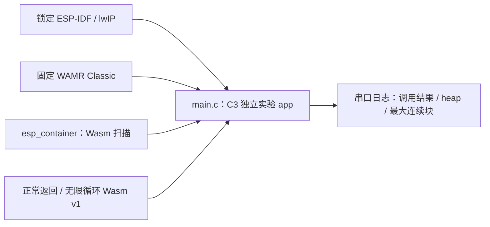

# ESP32-C3 WAMR Classic 容量与指令预算原型

这个独立 IDF 工程使用两段无 imports、无 start 的标准 Wasm v1 字节：正常函数返回 0，死循环函数验证 1000 条指令额度，只有精确的 `Exception: instruction limit exceeded` 才算额度生效。构建时显式开启 WAMR 指令计量，选择 Classic/Normal loader，并关闭 Fast/AOT/WASI/guest pthread/共享内存与 bulk memory；`esp_container` 组件也在 CMake 配置期拒绝这些 profile 的错误组合。实例化前调用 `econtainer_wasm_check`，防止 WAMR 自动运行 start 或构造导出。运行时打印前后 8-bit heap 和最大连续块。

SDK 必须使用跨仓计划锁定的 ESP-IDF `fff9895c82d744c7237be8847347bdd1b07c6643` 与 esp-lwip `2758df4cd3666b3b2a5b53830148379326425c0d`。WAMR 由组件清单固定到公开维护 fork 的 `a34d721b630213f59fde0b40cebbb980903660e8`；构建后核对 `dependencies.lock` 和 WAMR 源编译 flags，再记录镜像摘要。此工程无 Wi-Fi、MQTT、FRP、OTA、签名包和产品驱动，不能当作完整 Base 容量验收。

```bash
source "$IDF_PATH/export.sh"
python3 components/esp_container/tools/check_sdk.py --path "$IDF_PATH"
idf.py -C examples/c3-runtime build
```

编译不写板。该仓当前没有实板写入授权；如后续获得精确设备和恢复基线授权，再按嵌入式标准进行单板实验。第 9/12/13 节定义的双固件、三包槽、内存峰值和真实异常验收均未由本例替代。

## 架构拓扑


