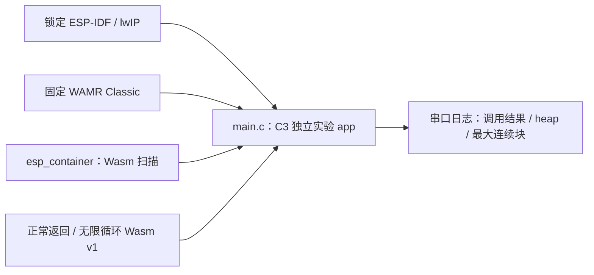

# ESP32-C3 WAMR Classic 容量与指令预算原型

这个独立 IDF 工程使用两段无 imports、无 start 的标准 Wasm v1 字节：正常函数返回 0，死循环函数验证 1000 条指令额度，只有精确的 `Exception: instruction limit exceeded` 才算额度生效。构建时显式开启 WAMR 指令计量，选择 Classic/Normal loader，并关闭 Fast/AOT/WASI/guest pthread/共享内存与 bulk memory；`esp_container` 组件也在 CMake 配置期拒绝这些 profile 的错误组合。实例化前调用 `econtainer_wasm_check`，防止 WAMR 自动运行 start 或构造导出。运行时打印前后 8-bit heap 和最大连续块。

SDK 必须使用跨仓计划锁定的公开 ESP-IDF fork `855937cf9dcee13ee9c423fb0319238cdc8d53fd`（官方父提交 `fff9895c82d744c7237be8847347bdd1b07c6643`）与 esp-lwip `2758df4cd3666b3b2a5b53830148379326425c0d`。WAMR 由组件清单固定到公开维护 fork 的 `a34d721b630213f59fde0b40cebbb980903660e8`；构建后核对 `dependencies.lock` 和 WAMR 源编译 flags，再记录镜像摘要。此工程无 Wi-Fi、MQTT、FRP、OTA、签名包和产品驱动，不能当作完整 Base 容量验收。

```bash
source "$IDF_PATH/export.sh"
python3 components/esp_container/tools/check_sdk.py --path "$IDF_PATH"
idf.py -C examples/c3-runtime build
```

编译不写板。该仓当前没有实板写入授权；如后续获得精确设备和恢复基线授权，再按嵌入式标准进行单板实验。第 9/12/13 节定义的双固件、三包槽、内存峰值和真实异常验收均未由本例替代。

## QEMU 仿真验证

固定 SDK 的官方可选 `qemu-riscv32` 支持 ESP32-C3。安装后重新导出 SDK 环境，再运行样例：

```bash
python3 "$IDF_PATH/tools/idf_tools.py" install qemu-riscv32
source "$IDF_PATH/export.sh"
idf.py -C examples/c3-runtime qemu
```

探针使用 IDF pthread 入口运行 WAMR；其 ESP-IDF 移植层会调用 `pthread_self()`，普通 `xTaskCreate()` 任务不具备该线程身份。串口应先打印 `before` 的空闲堆与最大连续块，再显示 `run call_ok=1 result=0 exception=none`、`looping call_ok=0 ... Exception: instruction limit exceeded`、`after` 资源值，以及 `normal=1 instruction_limit=1`。样例返回后 QEMU 继续空闲运行，可用 `Ctrl-A x` 退出。[128 KiB counter guest 仿真记录](../../docs/operations/qemu-counter-capacity-probe.md)另列加载、实例化、调用与卸载的堆采样；该实验的 C 代码仅在仓外临时副本，不属于本样例正式入口。仿真只验证最小代码路径，不代表实板资源峰值、完整产品装配或 Flash 包槽验收。

## 架构拓扑


