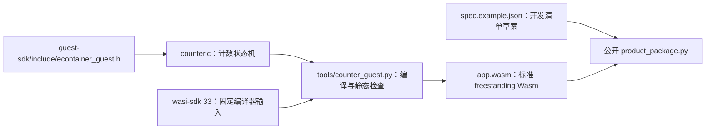

# Counter guest 草案

`counter.c` 只定义 `econtainer_init`、`econtainer_on_event` 和 `econtainer_stop` 三个显式导出入口，不使用宿主 import、WASI、线程、构造函数或设备输出。公开头位于 `guest-sdk/include/econtainer_guest.h`。`tools/counter_guest.py` 固定此样例的 freestanding 编译参数与静态 ABI/profile 检查；完整宿主 API、可安装产品包和真实 C3 业务生命周期仍未验收。

## 架构拓扑



## 可复现构建与检查

从 [wasi-sdk 官方 v33 Release](https://github.com/WebAssembly/wasi-sdk/releases/tag/wasi-sdk-33)获取与宿主平台匹配的资产，并在解压前核对官方发布的 SHA-256。macOS arm64 资产 `wasi-sdk-33.0-arm64-macos.tar.gz` 的 SHA-256 为 `85c997a2665ead91673b5bb88b7d0df3fc8900df3bfa244f720d478187bbdc78`；其 `VERSION` 为 `33.0+m`，LLVM 源码标识 `4434dabb6991`。将 `WASI_SDK_ROOT` 指向解压目录，在仓根执行：

```bash
python3 tools/counter_guest.py build --wasi-sdk "$WASI_SDK_ROOT" --output dist/app.wasm
python3 tools/counter_guest.py check --wasm dist/app.wasm
WASI_SDK_ROOT="$WASI_SDK_ROOT" python3 -m unittest tests.test_counter_guest -v
```

编译入口使用 `wasm32-unknown-unknown`、`-nostdlib`、`--no-entry`，只导出三个函数和固定线性内存。它显式关闭 bulk memory、reference types、SIMD、原子操作、尾调用及其他不需要的目标特性；静态检查要求没有 `target_features` 声明、import、start、table、data、隐式构造入口，三个函数签名分别为 `() -> i32`、`(i32,i32) -> i32`、`() -> i32`，内存初始值与最大值同为 128 KiB。链接器预留 4 KiB 栈，检查器核对栈指针在固定内存内；指令合法性仍由锁定 WAMR loader 验证。

可先按[仓根说明](../../README.md)构建锁定 WAMR 主机测试，再运行 `build-wamr/wamr_classic_test dist/app.wasm`，实际调用 init、两次 event、非法指针事件和 stop。该主机测试不会写板，也不证明设备资源配额、宿主句柄和事件复制正确。

`spec.example.json` 的 128 KiB 内存和 4 KiB 栈值与此样例编译输入一致，仅用于 host 打包测试。另有[宿主导入检查点](../../docs/operations/host-api-checkpoint.md)验证单调时间与有界日志的私有运行切片；这个 counter 仍无导入。P6-03 尚未证明 C3 容量，P6-04 的完整宿主授权、句柄归属和公开运行期 ABI 尚未冻结；P6-05 的签名向量与设备验包也未完成，因此本样例还不是可安装产品包。
