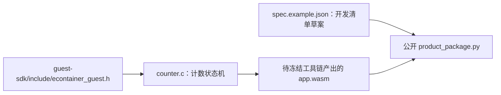

# Counter guest 草案

`counter.c` 只定义 `econtainer_init`、`econtainer_on_event` 和 `econtainer_stop` 三个显式导出入口，不使用宿主 import、WASI、线程、构造函数或设备输出。公开头位于 `guest-sdk/include/econtainer_guest.h`。这是 ABI 与打包输入的开发草案；目前尚无已冻结的 Wasm 编译器、可安装产品包或真实 C3 业务生命周期验收。

## 架构拓扑

在 P6-04 冻结函数签名与工具链、P6-03 验证容量、P6-05 冻结签名测试向量后，才可以把它作为独立产品包样例验收。`spec.example.json` 的资源值仅用于 host 工具测试，不是设备预算或产品授权。
