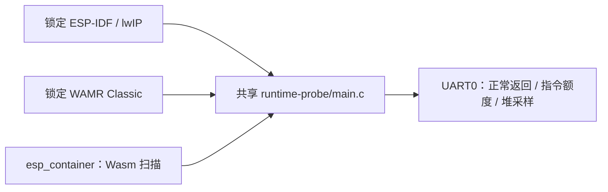

# ESP32-D0WD-V3 WAMR Classic 独立探针

本工程与 [C3 探针](../c3-runtime/README.md)共用 `examples/runtime-probe/main.c`。它以 `esp32` target、4 MiB Flash 和 UART0 控制台独立构建，在 ESP32-D0WD-V3 上检查同一标准 Wasm 正常返回、精确 1000 条指令额度及运行前后可用堆和最大连续块。源码不访问 Wi-Fi、凭据、NVS、OTA 分区或 GPIO，不对设备写 Flash。C3 的 QEMU 与实板结果不能替代此目标的实际构建和运行。

构建只使用本仓、组件清单锁定的 WAMR Classic 和 `components/esp_container/sdk-lock.json` 指定的 ESP-IDF/lwIP 完整提交。ESP32 与 C3 的 `dependencies.lock` 分别保存在各自工程，不共用 target 或构建目录：

```bash
source "$IDF_PATH/export.sh"
python3 components/esp_container/tools/check_sdk.py --path "$IDF_PATH"
idf.py -C examples/esp32-runtime build
```

构建后须核对 `dependencies.lock` 的 `target: esp32`、WAMR 完整 SHA、实际 `sdkconfig` 的 target/控制台、app 大小及摘要。这个最小探针不含 Base、FRP、MQTT、OTA、签名业务包或三包槽；其构建成功也不能证明 4 MiB 完整组合容量。[2026-09-26 ESP32 实板检查点](../../docs/operations/development-checkpoint.md#esp32-d0wd-v3-uart0-实板最小探针)记录旧 AT bootloader 下仅写现物应用槽的正常调用、指令额度异常及完整 Flash 恢复。以后每次写板仍须按[五仓主计划](https://github.com/darren-you/darren-space/blob/master/harness/docs/design/darren-space/global/esp-base-frp-mqtt-ota-container-development-plan.md)重新核对设备、两份一致的完整 Flash 恢复基线和当前分区/身份；不得使用本样例单 app `flash_args` 直接覆盖旧 AT 分区表。

## 架构拓扑


