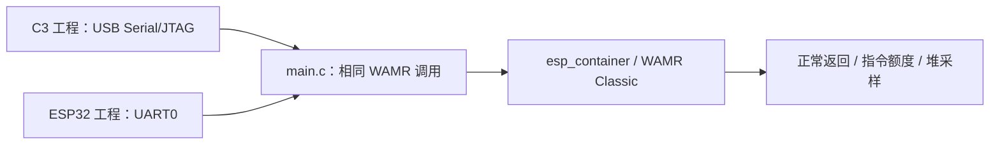

# 双目标共用运行探针

`main.c` 由 [C3 工程](../c3-runtime/README.md)和 [ESP32 工程](../esp32-runtime/README.md)分别编译。它在 WAMR Classic 中执行一个正常返回模块和一个无限循环模块，记录指令额度异常及运行前后堆状态。target、控制台、分区和依赖锁均由各自工程确定；此目录不单独构建，也不写设备 Flash。

## 架构拓扑

