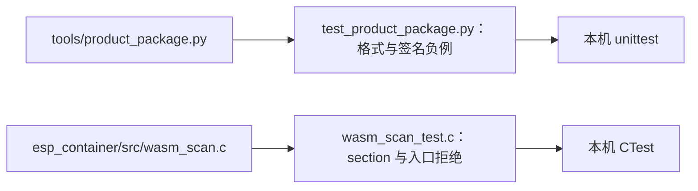

# 测试入口

## 架构拓扑



```bash
python3 -m unittest discover -s tests -v
cmake -S . -B build -DBUILD_TESTING=ON
cmake --build build
ctest --test-dir build --output-on-failure
```

Python 测试使用每次生成的 RSA-3072 临时测试密钥，覆盖确定性归档、签名/错误公钥、清单重复与未知键、Wasm start/import/构造入口、成员路径、尾随数据和容量拒绝。C 测试覆盖组件扫描的正常、截断、start、import 与隐式构造入口。测试密钥只存在系统临时目录，不进入 Git。

两套 host 测试不能证明设备流式 Flash 读回、运行时内存/期限、掉电恢复或真实 C3 组合。对应实板任务与阻塞在跨仓主计划 P6/P7 中记录。
