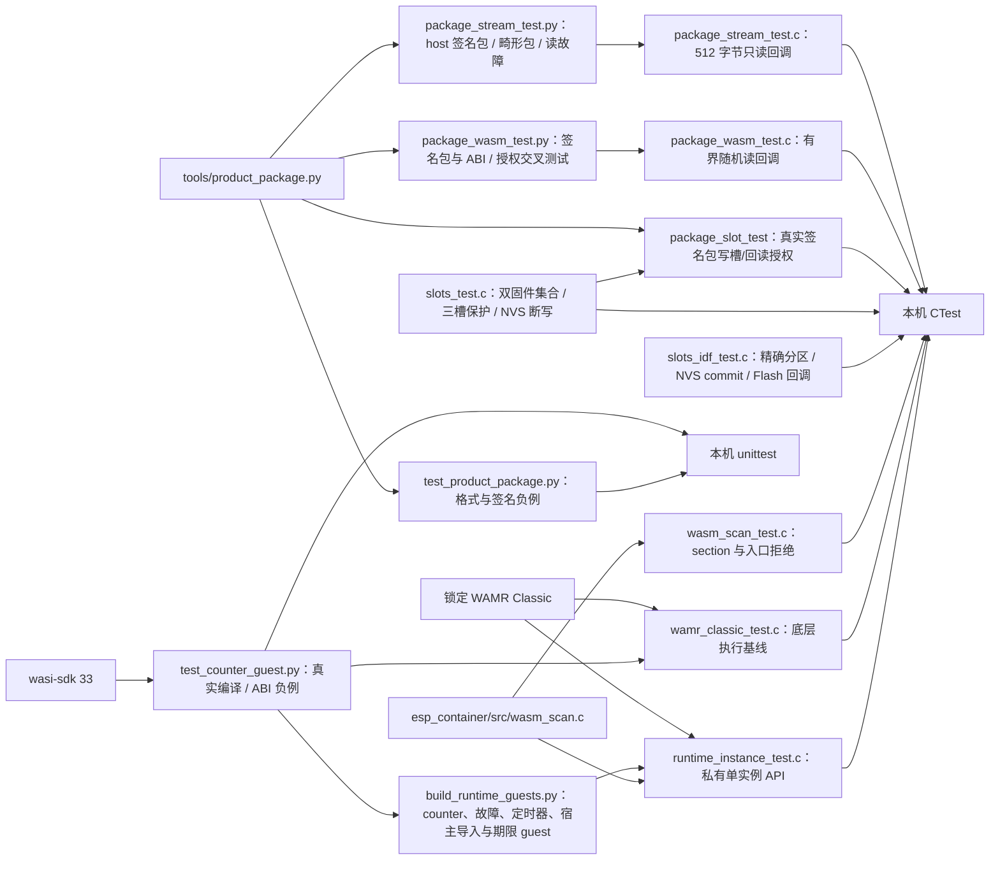

# 测试入口

## 架构拓扑



```bash
python3 -m unittest discover -s tests -v
cmake -S . -B build -DBUILD_TESTING=ON
cmake --build build
ctest --test-dir build --output-on-failure
```

`wamr_classic` 是底层真实引擎基线：先构建 C3 样例并核对锁文件中 WAMR 的 Git SHA 与 `.component_hash`，再按仓根 README 的 `ESP_CONTAINER_WAMR_SOURCE` 命令重新配置主机 CMake。该测试把正常执行与精确的 `Exception: instruction limit exceeded` 分开判定；其他 trap、加载失败和初始化失败都不能冒充额度命中。

同时设置 `ESP_CONTAINER_WASI_SDK_ROOT="$WASI_SDK_ROOT"` 会增加 `runtime_instance`：构建时临时编译真实 counter、事件读取、三个死循环、stop 返回失败、错误函数签名、时钟/日志、定时器和期限 guest；测试单实例占用、原始输入释放后继续调用、guest 内存中的事件复制、分离 guest 返回值与宿主状态、内存页上限、宿主分配失败、每入口正数指令预算、失败后释放、重复 stop/close、一次及周期定时事件、配额/取消/代次、停止后拒绝迟到投递，以及各 100 次 counter、时钟/日志、定时器和失败后重开生命周期。期限 guest 分别检查运行中导入拒绝与返回后结果拒绝，并核对本次日志丢弃、失败态和关闭。macOS 非 sanitizer 构建在每组第 10/50/100 次关闭后检查 `malloc_zone_statistics` 堆用量与 `TASK_VM_INFO` 虚拟地址用量持平，并记录 VM 区域数。生成的 Wasm 留在构建目录，不提交。此私有 API 在 ESP-IDF 上必须由同一个 `pthread_create` 宿主线程串行调用；普通 `xTaskCreate` 任务调用 WAMR 会在 `pthread_self` 断言。完整合同见[运行切片检查点](../docs/operations/single-instance-runtime-checkpoint.md)和[宿主导入检查点](../docs/operations/host-api-checkpoint.md)。

设置 `WASI_SDK_ROOT` 为官方 wasi-sdk 33 的解压目录后，Python 测试还会真实编译 counter 两次并比较不同输出路径的字节，验证包扫描接受产物，同时用改坏的函数签名、共享/无界内存、目标特性节和自动 start 作负例。先运行 `python3 tools/counter_guest.py build --wasi-sdk "$WASI_SDK_ROOT" --output dist/app.wasm`，再运行 `build-wamr/wamr_classic_test dist/app.wasm`，可让固定 WAMR Classic loader 实际执行三个 guest 入口；未提供该工具链时，counter 编译测试会明确跳过。

Python 测试使用每次生成的 RSA-3072 临时测试密钥，覆盖确定性归档、签名/错误公钥与错误 PSS 参数、清单顶层及嵌套重复键、未知字段和数值边界、Wasm start/导入白名单/构造入口、导入能力与 manifest 的对应、成员路径/顺序/类型/长度白名单、校验和、成员填充、额外成员、尾随非零或全零块及容量拒绝。固定占位签名的 host 编码回归向量改用最小有效 Classic ABI 模块，摘要见[包工具](../tools/README.md)；占位签名不能用于验签或发布。流式验包 CTest 以真实签名包、独立错误公钥、错误 PSS salt、畸形清单/ustar、断读与 64 KiB 载荷验证 512 字节读取上界。Wasm 静态检查 CTest 使用相同 Wasm 字节对照主机初筛与设备只读检查；旧主机曾接受的 `target_features`、缺失 ABI section、table、element、空导入节、入口签名、代码数量和签名清单内存上限八类负例现均由双方拒绝，并继续覆盖独立授权、坏 LEB/section/重复导入和读故障。设置固定 `WASI_SDK_ROOT` 后还检查真实编译的 counter、时钟/日志与定时器 guest。三槽 CTest 用假 Flash/NVS 注入 commit、读回及部分写入故障，验证 P0→P3 引用保护、两份固件各自重启对账、错误固件集合与超槽容量的擦除前拒绝、候选损坏下的旧包恢复及同 boot 停止证明。IDF provider CTest 以合成分区表检查缺失/错类型/只读/越界拒绝、绝对 Flash 地址转换、NVS 单 key commit/新 handle 读回，以及单固件集合下的三槽初始化和对账；它没有运行当前 Base 分区布局。C 测试还覆盖组件扫描的正常、截断、start、导入与隐式构造入口。测试密钥只存在系统临时目录，不进入 Git。

`package_slot` CTest 将真实临时签名包写入假 Flash 三槽，由槽引擎从实际候选槽回读，再执行签名、Wasm、产品身份、schema 和资源限额检查；错误产品、key ID、schema、内存、队列、指令预算、宿主期限均返回 `UNTRUSTED`，验签和 Wasm 静态扫描的二次读故障分别返回 `IO_FAILED`，均不得进入 PREPARED。该测试不证明设备真实分区或 Base 授权装配。

C3 单页分支以固定 wasi-sdk 33 生成 64 KiB counter 与宿主 API guest，并构造结构正确的旧两页 counter 作为负例。主机打包、设备包槽回读静态扫描和私有运行期都拒绝两页 guest；旧清单的 128 KiB 内存限额也分别由主机及设备端拒绝。该回归只证明限额接线，不证明 FRP/TLS/MQTT 与 guest 同时运行。

主机测试不能证明设备流式 Flash 读回、C3 运行时内存/期限、掉电恢复或真实 C3 组合。对应实板任务与阻塞在跨仓主计划 P6/P7 中记录。
