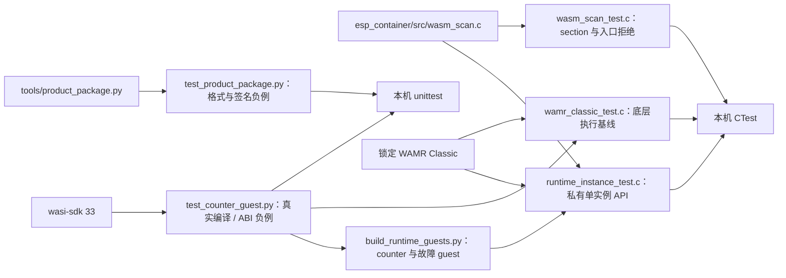

# 测试入口

## 架构拓扑



```bash
python3 -m unittest discover -s tests -v
cmake -S . -B build -DBUILD_TESTING=ON
cmake --build build
ctest --test-dir build --output-on-failure
```

`wamr_classic` 是底层真实引擎基线：先构建 C3 样例并核对锁文件中 WAMR 的 Git SHA 与 `.component_hash`，再按仓根 README 的 `ESP_CONTAINER_WAMR_SOURCE` 命令重新配置主机 CMake。该测试把正常执行与精确的 `Exception: instruction limit exceeded` 分开判定；其他 trap、加载失败和初始化失败都不能冒充额度命中。

同时设置 `ESP_CONTAINER_WASI_SDK_ROOT="$WASI_SDK_ROOT"` 会增加 `runtime_instance`：构建时临时编译真实 counter、事件读取、三个死循环和错误函数签名 guest；测试单实例占用、原始输入释放后继续调用、guest 内存中的事件复制、分离 guest 返回值与宿主状态、内存页上限、宿主分配失败、每入口正数指令预算、失败后释放、重复 stop/close 和连续八次 reopen。生成的 Wasm 留在构建目录，不提交。此私有 API 在 ESP-IDF 上必须由同一个 `pthread_create` 宿主线程串行调用；普通 `xTaskCreate` 任务调用 WAMR 会在 `pthread_self` 断言。完整合同见[运行切片检查点](../docs/operations/single-instance-runtime-checkpoint.md)。

设置 `WASI_SDK_ROOT` 为官方 wasi-sdk 33 的解压目录后，Python 测试还会真实编译 counter 两次并比较不同输出路径的字节，验证包扫描接受产物，同时用改坏的函数签名、共享/无界内存、目标特性节和自动 start 作负例。先运行 `python3 tools/counter_guest.py build --wasi-sdk "$WASI_SDK_ROOT" --output dist/app.wasm`，再运行 `build-wamr/wamr_classic_test dist/app.wasm`，可让固定 WAMR Classic loader 实际执行三个 guest 入口；未提供该工具链时，counter 编译测试会明确跳过。

Python 测试使用每次生成的 RSA-3072 临时测试密钥，覆盖确定性归档、签名/错误公钥与错误 PSS 参数、清单顶层及嵌套重复键、未知字段和数值边界、Wasm start/import/构造入口、成员路径/顺序/类型/长度白名单、校验和、成员填充、额外成员、尾随非零或全零块及容量拒绝。另有固定占位签名的 host 编码回归向量，摘要见[包工具](../tools/README.md)；占位签名不能用于验签或发布。C 测试覆盖组件扫描的正常、截断、start、import 与隐式构造入口。测试密钥只存在系统临时目录，不进入 Git。

主机测试不能证明设备流式 Flash 读回、C3 运行时内存/期限、掉电恢复或真实 C3 组合。对应实板任务与阻塞在跨仓主计划 P6/P7 中记录。
