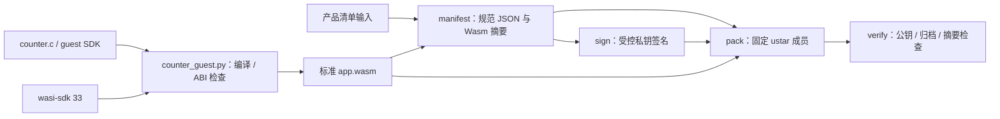

# product.pkg v1 主机工具

本目录的 `product_package.py` 提供 `manifest`、`sign`、`pack`、`verify` 四个命令。只处理精确顺序的 `manifest.json`、`signature.bin`、`app.wasm` 三个普通成员；签名域为 `ESP-CONTAINER-PRODUCT-V1` 加一个零字节，再加 manifest 的精确 UTF-8 字节。RSA-3072/PSS 使用 SHA-256、MGF1-SHA-256 和 32 字节 salt。公钥由调用方提供，包内不携带新信任锚。

## 架构拓扑



准备独立 host 依赖：

```bash
python3 -m venv .venv
.venv/bin/pip install -r requirements.txt
```

以下仅示例本地测试材料；不要把真实签名私钥提交到仓库。[counter 样例](../examples/counter/README.md)提供锁定 wasi-sdk 33 的 `tools/counter_guest.py build/check` 入口。本打包工具只做初始 Wasm 外形检查，不执行 counter 的精确 ABI/profile 检查。

```bash
.venv/bin/python tools/product_package.py manifest --spec examples/counter/spec.example.json --wasm dist/app.wasm --output dist/manifest.json
.venv/bin/python tools/product_package.py sign --manifest dist/manifest.json --private-key test-private.pem --key-id test-key --output dist/signature.bin
.venv/bin/python tools/product_package.py pack --manifest dist/manifest.json --signature dist/signature.bin --wasm dist/app.wasm --output dist/product.pkg
.venv/bin/python tools/product_package.py verify --package dist/product.pkg --public-key test-public.pem --key-id test-key
```

`manifest` 使用排序且无多余空白的唯一 JSON 编码，拒绝重复键、未知字段与不受支持的版本。`pack` 对给定的三份输入生成确定性的无压缩 POSIX ustar 字节，固定成员顺序、mtime、uid/gid、mode 与填充；`verify` 还要求两个结束块和补齐至 10 KiB ustar record 的规范长度，额外全零尾块也会拒绝。RSA-PSS 采用随机 salt，重复 `sign` 的签名字节可不同；复用同一份已签名 `signature.bin` 才能逐字节重现包。生产签名输入的密钥来源与审批属于发布侧，本工具不生成或轮换任何既有生产凭据。

当前 host 编码回归向量使用 `examples/counter/spec.example.json` 的清单字段、8 字节 Wasm v1 空模块，以及 `bytes(range(256)) + bytes(range(128))` 作为固定的 384 字节占位签名。生成的规范 manifest 长 545 字节、SHA-256 为 `0e6cba55543b3bd443881f08dc8a0c2d431d0376fe04c3ab901bb858cc0da6e4`；归档长 10,240 字节、SHA-256 为 `f72ef6b500a1dee059625df8772b2e5ad5c9d7a4fd5adf04e4fb1ce0271e6c67`。此占位签名不具备密码学效力，向量仅用于锁住当前主机编码行为；P6-05 的最终包容量、ABI 和发布签名合同仍待验证。

当前 `--max-wasm-bytes` 默认 512 KiB 是 host 原型拒绝上限，不是已冻结的 C3 业务包容量。设备侧流式解析、Flash 回读验签、授权、ABI/配额、三包槽与安装 API 尚待实测和实现；本工具的成功结果不能代表设备已可安全安装。
