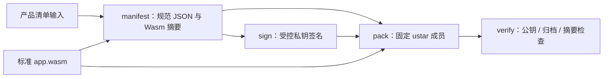

# product.pkg v1 主机工具

本目录的 `product_package.py` 提供 `manifest`、`sign`、`pack`、`verify` 四个命令。只处理精确顺序的 `manifest.json`、`signature.bin`、`app.wasm` 三个普通成员；签名域为 `ESP-CONTAINER-PRODUCT-V1` 加一个零字节，再加 manifest 的精确 UTF-8 字节。RSA-3072/PSS 使用 SHA-256、MGF1-SHA-256 和 32 字节 salt。公钥由调用方提供，包内不携带新信任锚。

## 架构拓扑



准备独立 host 依赖：

```bash
python3 -m venv .venv
.venv/bin/pip install -r requirements.txt
```

以下仅示例本地测试材料；不要把真实签名私钥提交到仓库。`app.wasm` 应由独立、受控的 Wasm 工具链编译，并经当前工具静态检查；示例源码位于 `examples/counter`。

```bash
.venv/bin/python tools/product_package.py manifest --spec examples/counter/spec.example.json --wasm app.wasm --output manifest.json
.venv/bin/python tools/product_package.py sign --manifest manifest.json --private-key test-private.pem --key-id test-key --output signature.bin
.venv/bin/python tools/product_package.py pack --manifest manifest.json --signature signature.bin --wasm app.wasm --output product.pkg
.venv/bin/python tools/product_package.py verify --package product.pkg --public-key test-public.pem --key-id test-key
```

`manifest` 使用排序且无多余空白的唯一 JSON 编码，拒绝重复键、未知字段与不受支持的版本。`pack` 对给定的三份输入生成确定性的无压缩 POSIX ustar 字节，固定成员顺序、mtime、uid/gid、mode 与填充。RSA-PSS 采用随机 salt，重复 `sign` 的签名字节可不同；复用同一份已签名 `signature.bin` 才能逐字节重现包。生产签名输入的密钥来源与审批属于发布侧，本工具不生成或轮换任何既有生产凭据。

当前 `--max-wasm-bytes` 默认 512 KiB 是 host 原型拒绝上限，不是已冻结的 C3 业务包容量。设备侧流式解析、Flash 回读验签、授权、ABI/配额、三包槽与安装 API 尚待实测和实现；本工具的成功结果不能代表设备已可安全安装。
