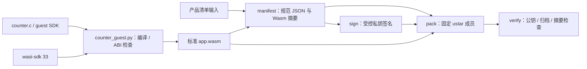

# product.pkg v1 主机工具

本目录的 `product_package.py` 提供 `manifest`、`sign`、`pack`、`verify` 四个命令。只处理精确顺序的 `manifest.json`、`signature.bin`、`app.wasm` 三个普通成员；签名域为 `ESP-CONTAINER-PRODUCT-V1` 加一个零字节，再加 manifest 的精确 UTF-8 字节。RSA-3072/PSS 使用 SHA-256、MGF1-SHA-256 和 32 字节 salt。公钥由调用方提供，包内不携带新信任锚。

## 架构拓扑



准备独立 host 依赖：

```bash
python3 -m venv .venv
.venv/bin/pip install -r requirements.txt
```

以下仅示例本地测试材料；不要把真实签名私钥提交到仓库。[counter 样例](../examples/counter/README.md)提供锁定 wasi-sdk 33 的 `tools/counter_guest.py build/check` 入口。本打包工具在 `manifest`、`pack` 和 `verify` 时检查设备流式扫描器可从签名清单和 Wasm 字节确定的 `wamr-classic-v1`、guest ABI v1、能力声明、导入、四项导出、函数类型、内存上限、代码数量与 section profile；counter 自身更窄的固定编译配方仍由样例检查器负责。平台独立授权和 WAMR 指令加载仍须由设备执行。

```bash
.venv/bin/python tools/product_package.py manifest --spec examples/counter/spec.example.json --wasm dist/app.wasm --output dist/manifest.json
.venv/bin/python tools/product_package.py sign --manifest dist/manifest.json --private-key test-private.pem --key-id test-key --output dist/signature.bin
.venv/bin/python tools/product_package.py pack --manifest dist/manifest.json --signature dist/signature.bin --wasm dist/app.wasm --output dist/product.pkg
.venv/bin/python tools/product_package.py verify --package dist/product.pkg --public-key test-public.pem --key-id test-key
```

`manifest` 使用排序且无多余空白的唯一 JSON 编码，拒绝重复键、未知字段与不受支持的版本。`pack` 对给定的三份输入生成确定性的无压缩 POSIX ustar 字节，固定成员顺序、mtime、uid/gid、mode 与填充；`verify` 还要求两个结束块和补齐至 10 KiB ustar record 的规范长度，额外全零尾块也会拒绝。RSA-PSS 采用随机 salt，重复 `sign` 的签名字节可不同；复用同一份已签名 `signature.bin` 才能逐字节重现包。生产签名输入的密钥来源与审批属于发布侧，本工具不生成或轮换任何既有生产凭据。

Wasm 初筛只接受 `econtainer.monotonic_ms() -> i64`、`econtainer.log(i32, i32) -> i32`、`econtainer.timer_start(i32, i32) -> i64` 和 `econtainer.timer_cancel(i64) -> i32` 四项精确函数导入；实际导入分别要求已签名 manifest 的 `monotonic-time`、`log`、`timer` 能力。manifest 声明只表达包需求，设备最终授权与定时器数量上限仍由平台策略决定；本主机工具没有设备安装或授予权限的入口。

当前 host 编码回归向量使用 `examples/counter/spec.example.json` 的单页清单字段、`tests/wasm_fixture.py` 生成的 136 字节最小有效 Classic ABI 模块，以及 `bytes(range(256)) + bytes(range(128))` 作为固定的 384 字节占位签名。生成的规范 manifest 长 546 字节、SHA-256 为 `e171dcdd96587b2ebe31bd18a7c83b13fc764b9eeb37ed46c763d4fc7df6bd5e`；归档长 10,240 字节、SHA-256 为 `8030e8209753cf24fe16581483dd9c590ab6260282bed4fa59b4f348afb7c562`。旧的 8 字节空模块不具备设备所需的 ABI section，现已被主机拒绝。占位签名不具备密码学效力，向量仅用于锁住当前主机编码行为；P6-05 的最终包容量与发布签名合同仍待验证。

当前 C3 分支的主机初筛、签名清单和设备回读静态扫描都只接受初始与最大线性内存各一页、清单内存限额 64 KiB 的 guest；私有运行期也固定一页准入，详见[C3 单页切片](../docs/operations/c3-low-memory-profile.md)。当前设备扫描器与 host 初筛仍共同拒绝超过 512 KiB 的 Wasm；`--max-wasm-bytes` 可进一步降低 host 限额，不能提高设备上限。这个 Flash 大小上限不是已冻结的 C3 业务包容量。组件已有[只读流式验包及 Wasm 静态检查切片](../docs/operations/package-stream-checkpoint.md)及候选槽签名包回读准入；设备检查使用验包后得到的签名清单需求，并另外要求平台独立提供能力、内存和栈授权。真实设备分区、完整平台授权和安装链路尚未闭合；本工具的成功结果不能代表设备已可安全安装。
